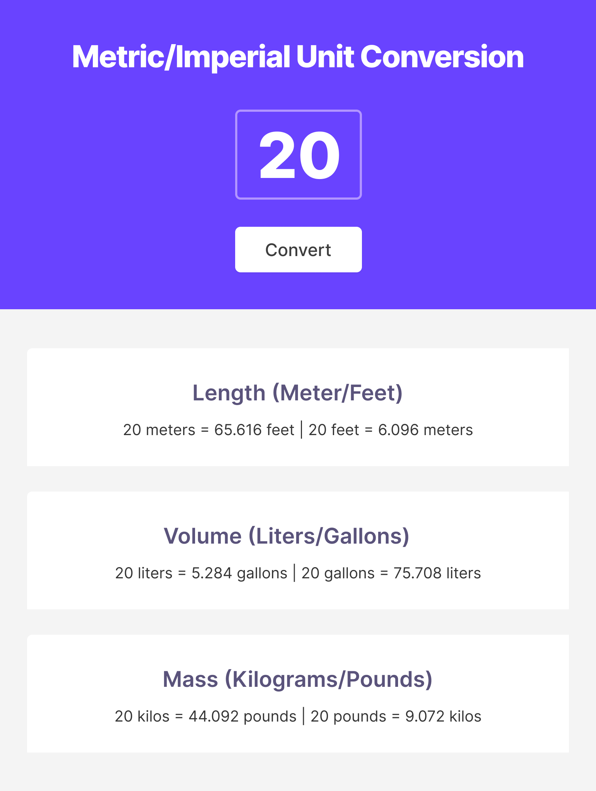

# Unit Converter

## Requirements

- Generate all conversions when the user clicks "convert"

-  Round the numbers down to 3 decimal places. 

Protip: [Generate random number](https://coreui.io/blog/how-to-generate-a-random-number-in-javascript/)

- Here is the screenshot how the website will look like

